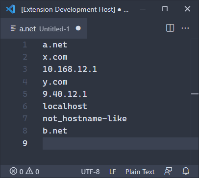

# Sort Hosts

A Visual Studio Code Extension to sort hosts.

## Usage

1.  Select lines.
    If no line is selected, the entire text is taken.
2.  Press Ctrl+Shift+P or F1 to show *Command Palette*.
3.  Execute **Sort Hosts**.

## Features

- Commas, semicolons, and whitespace character are treated as separators.
- Words are sorted by hostname, IPv4 address, and other.
  - Hostnames are sorted by top-level domain, second-level domain ...
  - IPv4 addressed are sorted by numbers.
  - Others are sorted normally.
- IPv6 addresses are not supported.
  They are treated as *others* above.
